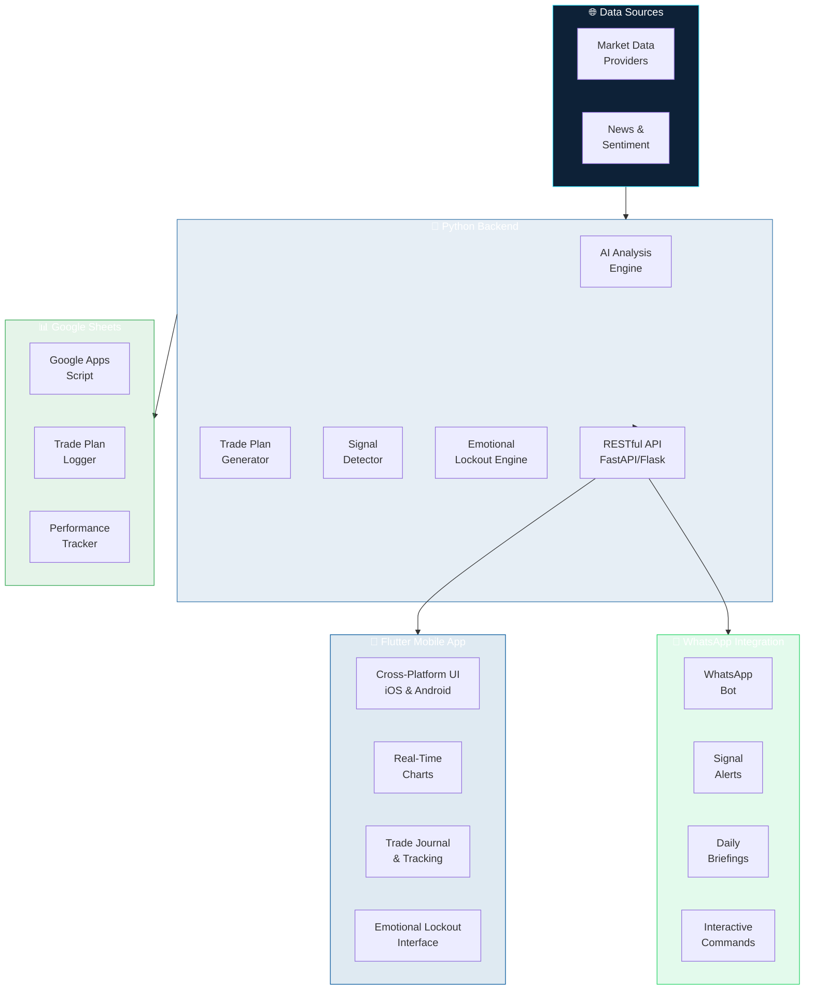
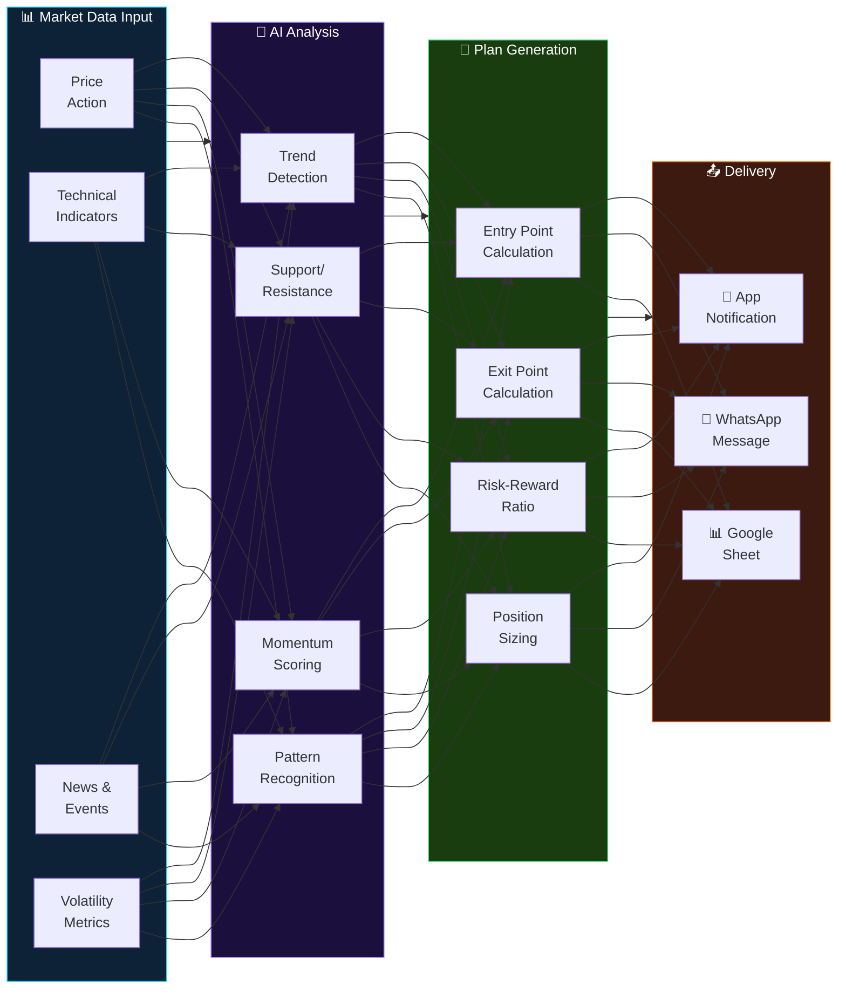
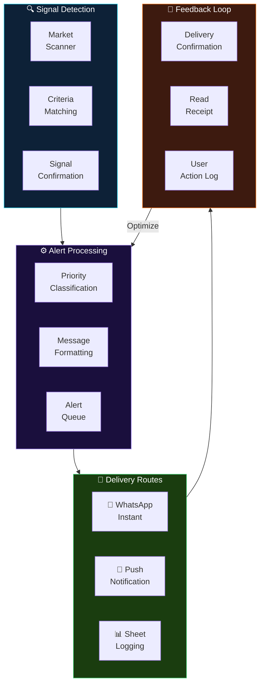
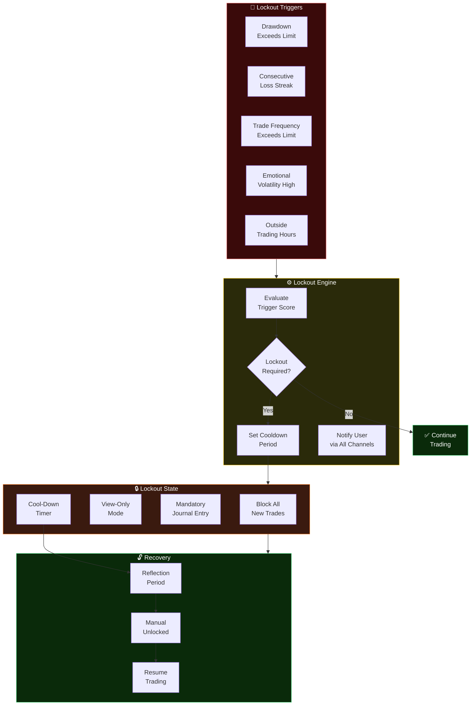

<!-- BANNER -->


<!-- TYPING SVG -->
<div align="center">
  <a href="https://git.io/typing-svg">
    
  </a>
</div>

<br/>

<!-- BADGES -->
<div align="center">

[](https://flutter.dev/)
[](https://python.org/)
[](https://www.whatsapp.com/)
[](./LICENSE)

</div>

---

## Overview

**Trading Plan AI Interactive** is an AI-powered market intelligence platform that combines a Flutter mobile app, a Python analysis backend, and WhatsApp integration for real-time trading signal delivery. Designed as a personal decision-support tool, it provides market analysis, trade plan generation, and instant notifications via WhatsApp — keeping you informed without requiring you to stare at charts all day.

## Features

### AI Market Analysis
- Multi-timeframe technical analysis
- Trend detection and momentum scoring
- Support/resistance level identification
- Pattern recognition across markets

### Trade Plan Generation
- AI-generated trade plans with entry/exit points
- Risk-reward ratio calculations
- Position sizing based on account size and risk tolerance
- Plan templates for different trading styles

### WhatsApp Integration
- Real-time signal alerts via WhatsApp
- Daily market briefings delivered to your phone
- Interactive commands (check prices, request analysis)
- Customizable alert thresholds

### Flutter Mobile App
- Cross-platform (iOS & Android)
- Real-time charts and market data
- Trade plan tracking and journaling
- Performance analytics dashboard

### Python Backend
- Market data collection and processing
- AI analysis engine
- WhatsApp Business API integration
- RESTful API for Flutter client

## Visual Architecture

> Interactive diagrams showing multi-platform architecture, AI plan generation, signal delivery, and emotional lockout system.

### Multi-Platform Architecture



### AI Trading Plan Flow



### Signal Alert Pipeline



### Emotional Lockout System



> **The Emotional Lockout System** is designed to prevent impulsive trading decisions during high-stress or high-loss periods. It enforces mandatory cool-down periods and journaling before trading can resume.

---

## Honest Notes

> **Important:**

- **Personal Decision-Support Tool** — This is designed to support your decision-making, not replace it. The final trade decision is always yours.
- **Not a Guaranteed Trading System** — No AI system can guarantee trading profits. Markets are inherently unpredictable and losses are possible.
- **WhatsApp Rate Limits** — WhatsApp Business API has message rate limits and requires approval. Personal WhatsApp integration may have restrictions.
- **API Dependencies** — Relies on market data providers which may have rate limits, downtime, or changed pricing.

## Quick Start

### Prerequisites
- Flutter 3.x SDK
- Python 3.11+
- WhatsApp Business API account (or Twilio)

### Installation

```bash
git clone https://github.com/mulkymalikuldhrs/Trading-Plan-AI-Interactive.git
cd Trading-Plan-AI-Interactive

# Python backend
cd backend
pip install -r requirements.txt

# Flutter app
cd ../app
flutter pub get
```

### Running

```bash
# Backend
cd backend && python main.py

# Flutter
cd app && flutter run
```

## Disclaimer

This is a personal decision-support tool, not a guaranteed trading system. All trading involves risk of loss. AI-generated insights are for informational purposes only and do not constitute financial advice. Always consult a qualified financial advisor.

## License

**MIT License** — see [LICENSE](./LICENSE) for details.

## Author

<div align="center">

**Mulky Malikul Dhaher**

[](https://github.com/mulkymalikuldhrs)
[](mailto:mulkymalikudhr@mail.com)

</div>

---

<!-- FOOTER BANNER -->

